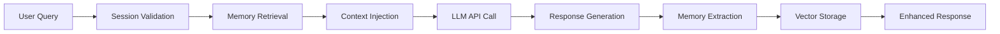

# LLM Memory SDK

## Overview

The Onairos LLM Memory SDK provides a unified interface for OpenAI, Anthropic Claude, and Google Gemini APIs with built-in **Retrieval-Augmented Generation (RAG)** capabilities. This enables AI models to remember and personalize interactions across sessions while maintaining user privacy.

## Key Features

### 🔗 **Unified API**
- Single interface for multiple LLM providers (OpenAI, Anthropic, Google)
- Drop-in replacement for existing OpenAI implementations
- Seamless model switching between providers

### 🧠 **Memory Enhancement** 
- Automatic extraction and storage of meaningful user context
- RAG-powered personalization for more relevant responses
- Privacy-focused memory storage (insights, not raw conversations)

### 🔐 **Session Management**
- JWT-based user authentication and isolation
- Secure session tokens with configurable expiration
- Guest and authenticated user support

### 📊 **Vector Storage**
- Pinecone integration for semantic memory search
- Intelligent context retrieval based on query similarity
- Scalable memory management with user isolation

## How It Works



1. **Authentication**: Validate user session with JWT tokens
2. **Memory Retrieval**: Search vector database for relevant user context
3. **Context Enhancement**: Inject retrieved memories into the prompt
4. **LLM Processing**: Send enhanced prompt to chosen LLM provider
5. **Memory Storage**: Extract and store meaningful insights for future use

## Quick Start

### Installation
```bash
npm install onairos
```

### Basic Usage
```javascript
import { OnairosClient } from 'onairos';

const onairos = new OnairosClient({
  openaiApiKey: process.env.OPENAI_API_KEY,
  pineconeApiKey: process.env.PINECONE_API_KEY,
  pineconeEnvironment: process.env.PINECONE_ENVIRONMENT,
  jwtSecret: process.env.JWT_SECRET
});

await onairos.initialize();

const userId = 'user-123';
const sessionToken = onairos.generateSessionToken(userId);

const response = await onairos.completions({
  model: 'gpt-4',
  messages: [{ role: 'user', content: 'What should I learn next?' }],
  userId,
  sessionToken
});
```

## Use Cases

### **Personalized AI Assistants**
- Remember user preferences and communication style
- Provide contextually relevant recommendations
- Maintain conversation continuity across sessions

### **Educational Platforms** 
- Track learning progress and knowledge gaps
- Personalize curriculum based on user background
- Remember previous explanations and adjust complexity

### **Customer Support**
- Recall customer history and preferences
- Provide consistent experience across interactions
- Reduce repetitive information gathering

### **Content Creation**
- Remember brand voice and style preferences
- Maintain consistency in generated content
- Learn from user feedback and corrections

## Benefits

✅ **Enhanced User Experience** - Personalized, context-aware responses  
✅ **Privacy Protection** - Stores insights, not raw conversations  
✅ **Easy Integration** - Drop-in replacement for existing OpenAI code  
✅ **Multi-Provider Support** - Choose the best model for each task  
✅ **Scalable Architecture** - Built for production environments  
✅ **Session Security** - JWT-based authentication and user isolation  

## Components

- **OnairosClient** - Main SDK interface with RAG capabilities
- **LLMWrapper** - Unified API for multiple LLM providers  
- **MemoryManager** - Vector storage and retrieval system
- **SessionManager** - JWT authentication and user management
- **extractMemory** - Intelligent memory extraction utilities

## Getting Started

Ready to add memory to your AI applications? Check out our [complete documentation](https://docs.onairos.uk) and [API reference](https://docs.onairos.uk/api) to get started.

For support, visit [support@onairos.uk](mailto:support@onairos.uk) or our [GitHub repository](https://github.com/zd819/onairos-npm). 